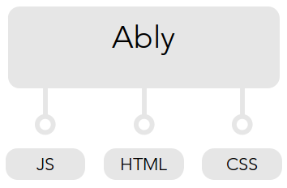

# ably

[](https://travis-ci.org/vgno/ably)[](https://codeclimate.com/github/vgno/ably)[](https://codeclimate.com/github/vgno/ably)

Provides a framework to perform A/B tests in the browser. This is still work in progress.

## Usage example

```js
// Add a test
ably.addTest({
    name: 'button-color',
    variants: ['red', 'green'],
    randomizer: ably.mathRandomRandomizer,
    scope: new CookieScope()
});

// Subscribe to variants
ably
    // Subscribe to test 'button-color' variant 'red'
    .when('button-color', 'red', function () {
        $('buy-button').css('background-color', 'red');
    })
    // Subscribe to test 'button-color' variant 'green'
    .when('button-color', 'green', function () {
        $('buy-button').css('background-color', 'green');
    });
```

## APIs

Ably exposes three APIs: JS, HTML and CSS.



### JS API

Use it to alternate **behaviour**.

```js
ably
    // Subscribe to test 'thank-you-action' variant 'alert'
    .when('thank-you-action', 'alert', function () {
        $('buy-button').click(function() {
            alert('Thank you!');
        });
    })
    // Subscribe to test 'thank-you-action' variant 'redirect'
    .when('thank-you-action', 'redirect', function () {
        $('buy-button').click(function() {
            location.href = '/thank-you-page.html';
        });
    });
```

### HTML API

Use it to alternate **content**.

```html
  <button class="ably-button-text-buy">
    Buy Now!
  </button>
  
  <button class="ably-button-text-subscribe">
    Subscribe!
  </button>
```

Ably will only show the selected variant.

### CSS API

Use it to alternate **styling**.

HTML:

```html
<!-- Ably automatically appends the selected variant as a class to the body element -->
<body class="ably-button-color-red">

  <button id="buy-now-button">
    Buy Now!
  </button>

</body>
```

CSS:

```css
/*
 * You specify different CSS rules for variants
 */
body.ably-button-color-red #buy-now-button
    background-color: #ff0000;
}

body.ably-button-color-green #buy-now-button
    background-color: #00ff00;
}
```

### Why use HTML & CSS APIs?

Use the HTML & CSS APIs when you want to describe variants that alternate **content** or **styling**. Using the HTML & CSS APIs helps avoid the flickering effect that you can observe when you manipulate DOM elements via Javascript.

This is achieved by empowering the browser to style elements early, while the DOM is still parsed. Behind the scenes Ably adds the variant that got selected as a class to your `<body>` element

```html
<body class="ably-button-text-buy">
```

...and generates some CSS to make it work.

From this moment on the logic of showing/hiding the variants is offloaded entirely to the browser. This works really fast. The browser knows how to style your elements before they are even parsed!

## Architecture

Read more about the architecture in [Architecture](docs/architecture.md).
