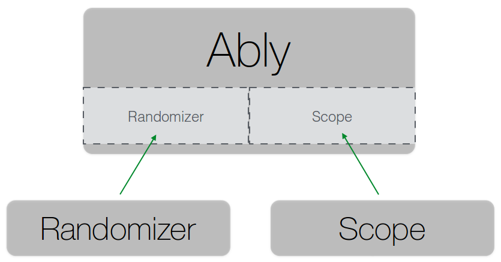

# ably
Provides a framework to perform A/B tests in the browser

# JS API

## Usage example ##

```js
var ably = new Ably({
    name: 'button-color',
    randomizer: new MathRandomRandomizer([
        'red': 40, 
        'green': 60
    ]),
    scope: new CookieScope()
});

ably
    .scenario('red', function (button) {
        button.style.backgroundColor = '#ff0000';
    })
    .scenario('green', function (button) {
        button.style.backgroundColor = '#ff0000';
    })
    .run(document.getElementById('purchase-button'));
```

## Architecture



### Randomizer ###

A `Randomizer` assigns test subjects to groups.

#### Randomizer Interface ####

| Function | Description                                         |
| -------- | :-------------------------------------------------- |
| `.get()` | Get the assigned group |

#### Example ####

```js
var randomizer = new Randomizer();
// ...
var group = randomizer.get();
console.log('I was assigned to group ' + group);
```

#### MathRandomRandomizer ####

A type of `Randomizer` that assigns users to groups using `Math.random()` function.

```js
var randomizer = new MathRandomRandomizer([
    'red': 40, 
    'green': 60
    ]);
var group = randomizer.get();
console.log('I was assigned to group ' + group + ' using Math.random()');
```

#### StaticRandomizer ####

If you assign users to groups server-side, you can create an instance of `StaticRandomizer` and set the group statically using its `.set(group)` method.

```js
var randomizer = new StaticRandomizer();
randomizer.set('red');
// ...
var group = randomizer.get();
console.log('I was assigned to group ' + group + ' using a prepopulated randomizer');
```

### Scope ###

A `Scope` represents the scope of an experiment. It marks the boundary of where the experiment begins and where it ends. An experiment can be run within the scope of a cookie or within the scope of a logged-in session. Scope is simply a key-value store which remembers the state of an experiment. Specifically, it remembers which group the user was assigned to.

#### Scope Interface ####

| Function           | Description                              |
| ------------------ | :--------------------------------------- |
| `.get(key)`        | Get the value under key `key`            |
| `.set(key, value)` | Set the value under key `key` to `value` |

#### Example ####

```js
var scope = new Scope();

// Get the group the user was assigned to in the 'button-color' experiment
scope.get('button-color');

// Set the group the user was assigned to in the 'button-color' experiment to 'red'
scope.set('button-color', 'red');
```

#### CookieScope ####

```js
var scope = new CookieScope();

// Get the group the user was assigned to from a cookie
scope.get('button-color');

// Set the group the user was assigned to in the cookie
scope.set('button-color', 'red');
```

## HTML & CSS APIs

Purpose:

1. Make it possible to write an A/B test entirely in HTML or CSS without writing (almost) any Javascript.
2. Help avoid the flickering effect when showing/hiding/manipulating DOM elements via Javascript after the DOM is ready.

This is achieved by adding the selected variants as classes to the `body` element. This makes the browser able to style page elements early, before the entire DOM is loaded.

The variant classes will be added to the `body` element by Ably. The routine that adds those classes needs to be invoked as early as possible, preferably right after the opening `body` tag.

### HTML API

HTML:

```html
<!-- Ably automatically appends the selected variant as a class to the body element -->
<body class="ably-button-text-buy">

  <!-- You add class names to variants you want to show/hide -->
  <button class="ably-button-text-buy">
    Buy Now!
  </button>
  
  <button class="ably-button-text-subscribe">
    Subscribe!
  </button>

</body>
```

CSS:

```css
/*
 * CSS autogenerated by Ably
 */
body[class*="ably-button-text"] *[class*="ably-button-text"] {
    display: none;
}

body.ably-button-text-buy *[class*="ably-button-text-buy"] {
    display: initial;
}

body.ably-button-text-subscribe *[class*="ably-button-text-subscribe"] {
    display: initial;
}
```

### CSS API

HTML:

```html
<!-- Ably automatically appends the selected variant as a class to the body element -->
<body class="ably-button-color-red">

  <button id="buy-now-button">
    Buy Now!
  </button>

</body>
```

CSS:

```css
/*
 * You specify different CSS rules for variants
 */
body.ably-button-color-red #buy-now-button
    background-color: #ff0000;
}

body.ably-button-color-green #buy-now-button
    background-color: #00ff00;
}
```
