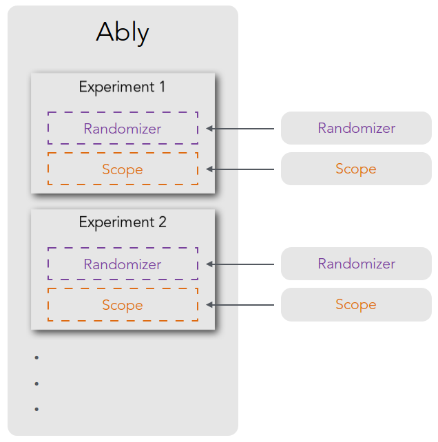

## Architecture

Ably contains a collection of *experiments*.

Each *experiment* has its own *randomizer* and its own *scope*.



### Randomizer ###

A randomizer assigns test subjects to groups.

A randomizer matches the following prototype:

```js
/**
 * Assigns to a variant by calling the callback
 * @param  {Function} callback The callback to pass the variant to
 * @param  {AblyTest} test The test being randomized
 */
function randomizer(callback, test);
```

#### Example

```js
/**
 * Assigns to a variant using the Math.random() method
 * @param  {Function} callback The callback to pass the variant to
 * @param  {AblyTest} test The test being randomized
 */
function exampleRandomizer(callback, test) {
    callback(test.variants[Math.floor(Math.random() * test.variants.length)]);
}
```

#### Use an existing randomizer

Ably exposes a randomizer you can just start using.

##### `uniform`

A type of randomizer that assigns users to groups using a uniform randomization provided by the `Math.random()` function.

#### Supply your own randomizer

##### Examples

Fetch the assignment from a dataset generated by the server.

```js
ably.setRandomizer(function myServerGeneratedRandomizer(callback, test) {
    callback(document.getElementById('server-generated-data').dataset.assignment);
});
```

Fetch the assignment through AJAX.

```js
ably.setRandomizer(function myServerGeneratedRandomizer(callback, test) {
    $.getJSON("/assigment", function(json) {
        callback(json.assigment);
    });
});
```

### Scope ###

A scope represents the scope of an experiment. It marks the boundary of where the experiment begins and where it ends. An experiment can be run within the scope of a cookie or within the scope of a logged-in session. A scope is simply a key-value store which remembers the state of an experiment. Specifically, it remembers which group the user was assigned to.

#### Scope Interface ####

| Function           | Description                              |
| ------------------ | :--------------------------------------- |
| `.has(key)`        | True if the scope has a value for `key`  |
| `.get(key)`        | Get the value under key `key`            |
| `.set(key, value)` | Set the value under key `key` to `value` |

#### Example ####

```js
// See if the user was assigned to a group in the 'button-color' experiment
scope.has('button-color');

// Get the group the user was assigned to in the 'button-color' experiment
scope.get('button-color');

// Set the group the user was assigned to in the 'button-color' experiment to 'red'
scope.set('button-color', 'red');
```
